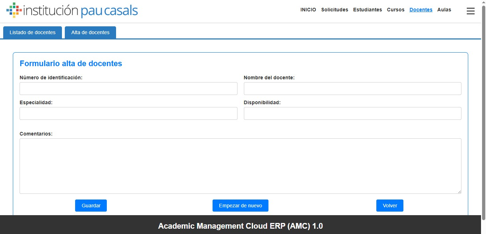
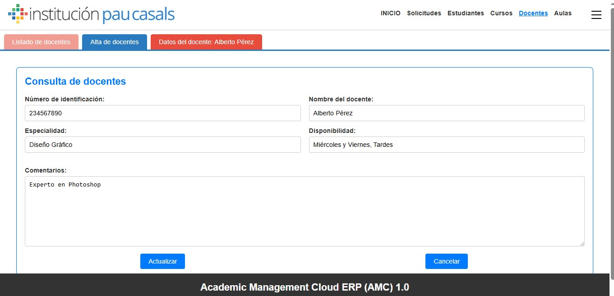

# Gestión de Docentes - ERP

Este proyecto es un sistema de gestión de docentes desarrollado como parte de un ERP (Sistema de Planificación de Recursos Empresariales). Permite administrar el control completo de los docentes, incluyendo su alta, edición y eliminación. El sistema está diseñado para ser intuitivo y eficiente, facilitando la gestión de la información docente en instituciones educativas.

## Tecnologías Utilizadas

- **Frontend**: HTML, CSS, JavaScript
- **Backend**: PHP
- **Base de Datos**: SQL
- **Entorno de Desarrollo**: Eclipse
- **Control de Versiones**: GitHub

## Estructura del Proyecto

El proyecto consta de los siguientes archivos principales:

- `accesobbdd.php`: Maneja la conexión a la base de datos.
- `actualizardocentesapi.php`: API para actualizar la información de los docentes.
- `altadocentes.php` y `altadocentesapi.php`: Interfaz y API para dar de alta nuevos docentes.
- `borrardocentesapi.php`: API para eliminar docentes.
- `consultardocentes.php` y `consultardocentesapi.php`: Interfaz y API para consultar la información de los docentes.
- `leerdocentesapi.php`: API para leer datos de los docentes.
- `listadocursos.php` y `listadocursodocentesapi.php`: Interfaz y API para listar cursos asociados a docentes.
- `listadodocentes.php`: Interfaz para listar todos los docentes.
- `operativadocentes.js`: Contiene la lógica de JavaScript para la operatividad del frontend.

## 🖼 Capturas de pantalla

  
*Formulario para dar de alta nuevos docentes.*

  
*Listado de todos los docentes registrados con las opciones consultar, eliminar, ver la información actual del docente y comentarios sobre el.*

  
*Formulario para consultar o actualizar la información de un docente.*
esto es lo que queria hacer con las capturas
